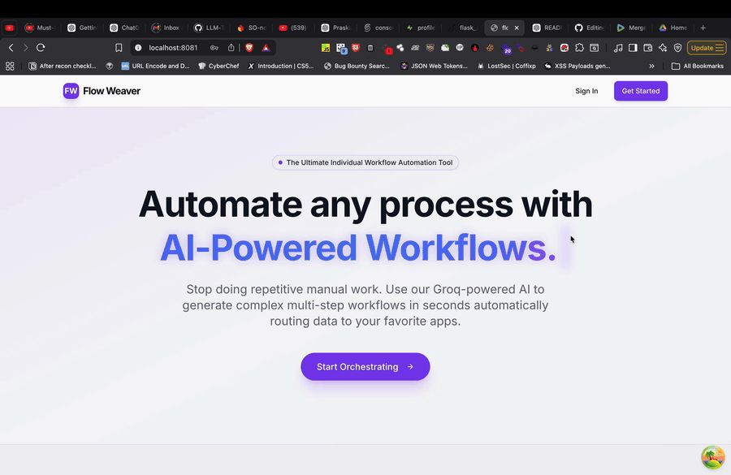

# 🌌 Flow Weaver: Enterprise AI Workflow Architect


A powerful, state-of-the-art **AI Workflow Orchestration Platform** built for high-performance teams.  
Flow Weaver streamlines complex business processes through **automated AI pipeline generation**, **human-in-the-loop approvals**, and **passive rule evaluation**, aligned with modern enterprise SaaS operations.

## 🌐 Live Application
[https://flow-weaver-yuki.vercel.app/](https://flow-weaver-yuki.vercel.app/)

---

## 🎥 Demo Video link
https://drive.google.com/drive/folders/155ka733K1SlicONjB8LMvLXrNo6hKfRV?usp=drive_link

---


## 🎥 Live Demo



---

## 🚀 Quick Start

### Prerequisites
- **Node.js 18+**
- **Supabase Account** (PostgreSQL + RLS)
- **Upstash Redis** (Performance Caching)
- **Groq API Key** (Llama 3.3 Inference)

---

### Installation

```bash
# Clone the repository
git clone https://github.com/yukeshwaran-N/flow-weaver-ui.git
cd flow-weaver-ui

# Install dependencies
npm install

# Start the development server
npm run dev
```

## ✨ Features

### 🔍 AI-Powered Architect
- **1-Click Generation** of complex workflows from natural language prompts.
- **Intelligent Node Mapping**:
  - **Tasks & Decisions** (Auto-logic)
  - **Human Approvals** (Interactive)
  - **Email Notifications** (Automated)
- **Sub-second Inference** leveraging Groq LPU technology.
- **Dynamic Graph Rendering** powered by Xyflow (React Flow).

---

### 🧬 SaaS Multi-Tenancy & Security
- Built-in **PostgreSQL Row-Level Security (RLS)** for cryptographically isolated tenant data.
- **Role-Based Access Control (RBAC)**:
  - Platform Admin & Company Admin
  - Manager & Employee
- **Zero-Flicker Hydration**: Centralized Context API for seamless session management.
- **Secure WebSockets** for real-time collaboration and execution tracking.

---

### 🔗 Enterprise-Grade Integrations
- **Global Caching**: Upstash Redis for low-latency session and state mirroring.
- **Notification Server**: Node.js microservice for SMTP-based transactional email delivery.
- **Execution Sandbox**: FastAPI bridge for secure local Python/JS logic execution.
- **Audit Logs**: Comprehensive activity tracking for every automated step.

---

### ⚡ Performance & LUX UX
- **Luxury UI Design**: Dynamic Typewriter effects with premium **Outfit** & **Caveat** fonts.
- **Micro-animations**: Smooth HSL-tailored transitions via Framer Motion.
- **High-Impact Visuals**: Custom glassmorphism, `text-glow`, and tri-color gradients (Indigo-Blue-Violet).
- **Responsive Layouts**: Optimized for mobile and desktop dashboards.

---

## 🛠️ Performance Architecture

| Layer | Technology | Purpose |
| :--- | :--- | :--- |
| **Logic** | `React 18 + TS` | Core App UI & Type-safe Development |
| **Persistence** | `Supabase` | PostgreSQL + Real-time WebSockets |
| **Accelerance** | `Redis` | Ultra-fast Session Caching |
| **Intelligence** | `Groq AI` | NLP to Workflow DAG Generation |

---

<div align="center">
  <p>Built with ❤️ for Modern Enterprises</p>
  <b>Flow Weaver</b> &copy; 2026
</div>
