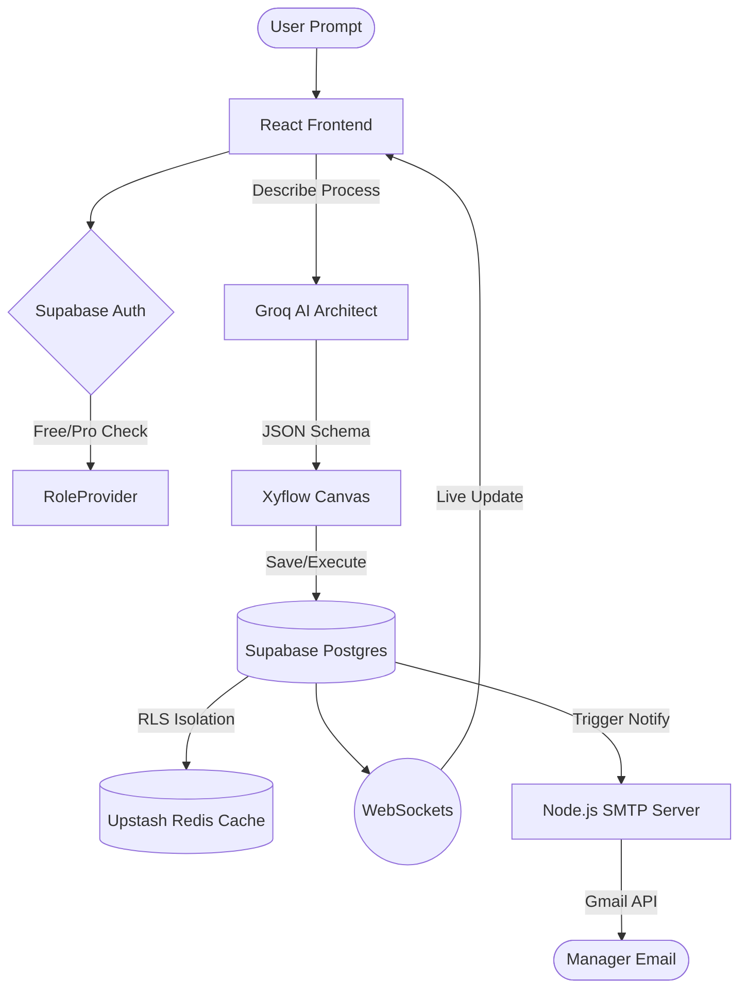

# 🌌 Flow Weaver: Enterprise AI Workflow Orchestration

<div align="center">
  
  
  
</div>

---

## 💎 The Vision
**Flow Weaver** is a high-performance, AI-native platform designed to bridge the gap between human decision-making and automated execution. It allows enterprises to describe complex business processes in plain English and automatically generate high-fidelity, executable workflow graphs.

---

## 🛠️ Tech Stack Matrix

| Layer | Technology | Key Feature |
| :--- | :--- | :--- |
| **Frontend Core** | `React 18` | Concurrent Rendering & Concurrent UI Patterns. |
| **State Management** | `React Context` | Optimized global providers (`Auth`, `Role`, `Company`) to prevent prop-drilling. |
| **Workflow Engine** | `Xyflow (React Flow)` | High-performance interactive canvas for complex DAG (Directed Acyclic Graph) rendering. |
| **AI Intelligence** | `Groq Cloud (Llama 3.3)` | Sub-second inference for Natural Language to JSON Graph generation. |
| **Primary Database** | `Supabase (PostgreSQL)` | Enterprise-grade persistence with cryptographically secure Row-Level Security (RLS). |
| **Global Cache** | `Upstash Redis` | Low-latency session caching and execution state mirroring. |
| **Real-time Sync** | `Supabase Realtime` | **WebSocket-based** synchronization for collaborative workflow editing and execution tracking. |
| **Notification Engine** | `Node.js + SMTP` | SMTP-based transactional email delivery for approvals and rejections. |
| **Styling** | `Tailwind CSS 3.4` | Utility-first design system with premium HSL-tailored colors. |
| **Animations** | `Framer Motion` | Fluid entrance/exit transitions and micro-interactions. |

---

## 🏗️ System Architecture



---

## 🔐 Core Technical Pillars

### 1. The AI Architect (NLP to Graph)
Integrating **Groq's Llama-3.3-70B** model, we implemented a specialized prompt engineering layer that converts unstructured descriptions (e.g., *"If amount > 5000, send to CEO else Manager"*) into valid workflow nodes and reactive edges. 
- **Sub-1s Inference**: Leveraging Groq’s LPU technology.
- **Structured JSON Output**: Ensures the generated graphs are immediately executable without manual repair.

### 2. SaaS Multi-Tenancy & Security
Every query is protected by **PostgreSQL Row-Level Security (RLS)**.
- **Tenant Isolation**: Users only see data belonging to their specific `company_id`.
- **RBAC (Role-Based Access Control)**: Granular permissions for four roles: `platform_admin`, `company_admin`, `manager`, and `employee`.
- **Zero-Flicker Hydration**: Centralized `AuthProvider` and `RoleProvider` use cached session metadata to render the app shell instantly, fetching details in the background.

### 3. Performance Caching (Upstash Redis)
To achieve sub-100ms response times for critical paths:
- **Session Mirroring**: Stores active user roles and subscription tiers in Redis.
- **Rate Limiting**: Protects expensive AI endpoints from excessive usage.
- **State Caching**: Mirrors workflow execution status to minimize primary database hits during heavy polling.

### 4. Real-time Communication (WebSockets)
Leveraging **Supabase Realtime**, the platform establishes secure WebSocket channels for:
- **Collaborative Editing**: Multiple admins can see updates in the Workflow Editor instantly.
- **Execution Monitoring**: Employees see their workflow progress in real-time as steps complete or pause for approval.

---

## 💰 Premium Subscription Engine
The platform includes an automated **Pro Conversion Engine**:
- **Feature Gating**: AI generations and advanced rules are exclusive to `pro` tier profiles.
- **Upsell Popup**: A premium, motion-styled modal triggers 5 seconds after every reload for non-pro users, using local/session storage to track impressions.
- **Payment Architecture**: Prepared for Stripe/LemonSqueezy integration with a dedicated `subscription_tier` metadata field in the primary user profile.

---

## 📁 Project Blueprint

```bash
/src
  /providers     # The "Brain" - Auth, Role, & Data Contexts
  /components    # The "Skin" - Visual Nodes & UI Components
  /lib           # The "Nervous System" - Supabase, Redis, & AI Clients
  /pages         # The "Vessels" - High-impact Landing & Workspaces
/server          # The "Voice" - Node/SMTP microservice
/executor        # The "Hands" - Python-based code execution sandbox
```

---

## 🚀 Getting Started

### Prerequisites
- Node.js 18+
- Supabase Project (SQL schema in `supabase_schema.sql`)
- Redis instance (Upstash recommended)

### Environment Setup
Create a `.env` file:
```env
VITE_SUPABASE_URL=...
VITE_SUPABASE_ANON_KEY=...
VITE_UPSTASH_REDIS_REST_URL=...
VITE_UPSTASH_REDIS_REST_TOKEN=...
VITE_GROQ_API_KEY=...
GMAIL_USER=...
GMAIL_PASSWORD=...
```

---

<div align="center">
  <p>Built with ❤️ for High-Performance Teams</p>
  <b>Flow Weaver</b> &copy; 2026
</div>
